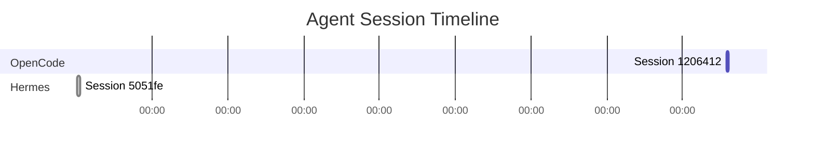

# Agent Sessions Dashboard Implementation Plan

> **For agentic workers:** REQUIRED SUB-SKILL: Use superpowers:subagent-driven-development or superpowers:executing-plans to implement this plan task-by-task. Steps use checkbox (`- [ ]`) syntax for tracking.

**Goal:** Add a real-time Agent Sessions visualization section to the Operator Dashboard, fed by a Rust backend that reads OpenCode and Hermes session data, renders Mermaid diagrams to SVG, and exposes everything via file-based IPC.

**Architecture:** A Rust binary `session-tracker` polls `~/.config/opencode/context-mode/sessions/` and `~/.hermes/sessions/`, generates three Mermaid diagram SVGs (timeline, tool usage, model routing), and writes a unified JSON state file to `/tmp/session-tracker.json`. The QML DashboardWidget.qml reads these files every 5s and displays the active tab's SVG above a scrollable text list of sessions.

**Tech Stack:** Rust (mermaid-rs-renderer, serde, chrono, walkdir), Quickshell QML, bash

---

## File Structure

```
dotfiles/quickshell/.config/quickshell/modules/widgets/DashboardWidget.qml   # canonical source (copied from live)
session-tracker/
  Cargo.toml
  src/
    main.rs          # CLI entry, file watcher loop, JSON output
    opencode.rs      # Read ~/.config/opencode/context-mode/sessions/stats-pid-*.json
    hermes.rs        # Read ~/.hermes/sessions/session_*.json
    mermaid.rs       # Generate Mermaid text → SVG via mermaid-rs-renderer
scripts/session-tracker.sh                                                    # wrapper / build helper
niri-modifications/README.md                                                   # reproducible setup docs
```

---

## IPC Contract (Critical — All Subagents Must Obey)

The Rust backend writes these files atomically (write to temp, rename):

| File | Format | Refresh |
|------|--------|---------|
| `/tmp/session-tracker.json` | JSON (schema below) | Every 5s |
| `/tmp/session-tracker-timeline.svg` | SVG XML | Every 5s |
| `/tmp/session-tracker-tools.svg` | SVG XML | Every 5s |
| `/tmp/session-tracker-models.svg` | SVG XML | Every 5s |

### `/tmp/session-tracker.json` Schema

```json
{
  "generated_at": "2026-05-12T14:30:00Z",
  "sessions": [
    {
      "id": "stats-pid-1206412",
      "agent": "opencode",
      "status": "active",
      "started_at": "2026-05-12T13:45:00Z",
      "uptime_seconds": 2700,
      "total_calls": 59,
      "tokens_saved": 315618,
      "cost_saved": 4.73,
      "model": "kimi-k2.6",
      "tools": {
        "ctx_execute": 38,
        "ctx_batch_execute": 12,
        "ctx_search": 4
      }
    },
    {
      "id": "20260504_001511_5051fe",
      "agent": "hermes",
      "status": "ended",
      "started_at": "2026-05-04T00:15:00Z",
      "uptime_seconds": 0,
      "total_calls": 0,
      "tokens_saved": 0,
      "cost_saved": 0,
      "model": "kimi-k2.6",
      "tools": {}
    }
  ]
}
```

**Status rules:**
- `active` = file mtime < 60s ago (OpenCode writes stats periodically; Hermes session file exists and is recent)
- `ended` = file mtime > 60s ago or session explicitly ended
- For Hermes, `status` is always `ended` unless a dashboard process is running (we can't detect live Hermes TUI sessions from files alone; mark as `active` only if the session file is the most recent and was modified in the last 5 minutes)

---

## Task 1: Fix DashboardWidget.qml Foundation

**Goal:** Copy the live widget to the repo, fix QML runtime errors preventing it from opening, fix Operations text overlapping.

**Files:**
- Create: `dotfiles/quickshell/.config/quickshell/modules/widgets/DashboardWidget.qml` (copy from `~/.config/quickshell/modules/widgets/DashboardWidget.qml`)
- Modify: `dotfiles/quickshell/.config/quickshell/shell.qml` (add "dashboard" to widgetRegistry)
- Modify: symlink at `~/.config/quickshell/modules/widgets/DashboardWidget.qml`

### Step 1: Copy and stage the file

```bash
cp ~/.config/quickshell/modules/widgets/DashboardWidget.qml \
   ~/Github/nightforge/dotfiles/quickshell/.config/quickshell/modules/widgets/DashboardWidget.qml
```

### Step 2: Fix `font.size` → `font.pixelSize`

In the Operations section, every `font.size: "11px"` is **invalid QML**. It must be `font.pixelSize: 11`. This causes default font size (larger) to be used, which overflows the layout.

Find all occurrences:
- Line ~397: `Text { text: dashboard.localIp; font.size: "11px"; color: mocha.text }`
- Line ~400: `Text { text: dashboard.wgStatus; font.size: "11px"; ... }`
- Line ~406: `Text { text: dashboard.dnsServer; font.size: "11px"; ... }`
- Line ~431: `Text { text: modelData.name; font.size: "11px"; ... }`
- Line ~454: `Text { text: ...; font.size: "11px"; ... }`
- Line ~464: `Text { text: ...; font.size: "11px"; ... }`

Replace ALL `font.size: "11px"` with `font.pixelSize: 11`.
Replace ALL `font.size: "12px"` with `font.pixelSize: 12`.
Replace ALL `font.size: "10px"` with `font.pixelSize: 10`.
Replace ALL `font.size: "14px"` with `font.pixelSize: 14`.

### Step 3: Fix Operations Rectangle layout binding loop

The current code has a binding loop risk:
```qml
Rectangle {
    Layout.fillWidth: true
    Layout.minimumHeight: 360
    Layout.preferredHeight: opsCol.height + 24   // DANGEROUS: circular
    ...
    ColumnLayout {
        id: opsCol
        anchors.left: parent.left; anchors.right: parent.right
        anchors.top: parent.top; anchors.margins: 16
        // NOT anchored bottom — good, but preferredHeight reads height which may be unstable
    }
}
```

Replace with:
```qml
Rectangle {
    Layout.fillWidth: true
    Layout.minimumHeight: 360
    implicitHeight: opsCol.implicitHeight + 32

    ColumnLayout {
        id: opsCol
        anchors.left: parent.left; anchors.right: parent.right
        anchors.top: parent.top; anchors.margins: 16
        spacing: 12
        ...
    }
}
```

This breaks the circular dependency: `opsCol.implicitHeight` is computed from children, not from parent height.

### Step 4: Ensure component loads without errors

In `shell.qml` (repo version), verify the `widgetRegistry` has a `"dashboard"` entry pointing to the correct component path. The live `Main.qml` uses `WindowRegistry.js` which already has it. If the repo's `shell.qml` is the active one, add:

```qml
"dashboard": { comp: "modules/widgets/DashboardWidget.qml", services: {} },
```

### Step 5: Update symlink

```bash
ln -sf ~/Github/nightforge/dotfiles/quickshell/.config/quickshell/modules/widgets/DashboardWidget.qml \
       ~/.config/quickshell/modules/widgets/DashboardWidget.qml
```

### Step 6: Test

```bash
echo "dashboard" > /tmp/qs_widget_state
# Verify the dashboard overlay opens and renders correctly
# Check Quickshell logs: journalctl --user -u quickshell -n 50
```

Expected: Dashboard opens showing Containers, VMs, and Operations sections with no text overlap.

---

## Task 2: Build Rust session-tracker Backend

**Goal:** Create a Rust binary that reads OpenCode and Hermes session JSON files, generates three Mermaid diagrams as SVG, and writes the unified state JSON.

**Files:**
- Create: `session-tracker/Cargo.toml`
- Create: `session-tracker/src/main.rs`
- Create: `session-tracker/src/opencode.rs`
- Create: `session-tracker/src/hermes.rs`
- Create: `session-tracker/src/mermaid.rs`

### Step 1: Initialize Rust project

```bash
cd ~/Github/nightforge
cargo new --bin session-tracker
cd session-tracker
```

### Step 2: Add dependencies

`Cargo.toml`:
```toml
[package]
name = "session-tracker"
version = "0.1.0"
edition = "2021"

[dependencies]
serde = { version = "1.0", features = ["derive"] }
serde_json = "1.0"
chrono = { version = "0.4", features = ["serde"] }
walkdir = "2.5"
mermaid-rs-renderer = "0.2"
```

### Step 3: Define data models

`src/main.rs` (top-level structs):
```rust
use serde::{Deserialize, Serialize};
use chrono::{DateTime, Utc};
use std::collections::HashMap;

#[derive(Serialize, Deserialize, Debug, Clone)]
pub struct Session {
    pub id: String,
    pub agent: String,      // "opencode" or "hermes"
    pub status: String,     // "active" or "ended"
    pub started_at: DateTime<Utc>,
    pub uptime_seconds: u64,
    pub total_calls: u64,
    pub tokens_saved: u64,
    pub cost_saved: f64,
    pub model: String,
    pub tools: HashMap<String, u64>,
}

#[derive(Serialize, Deserialize, Debug)]
pub struct TrackerState {
    pub generated_at: DateTime<Utc>,
    pub sessions: Vec<Session>,
}
```

### Step 4: Implement OpenCode reader

`src/opencode.rs`:
- Read `~/.config/opencode/context-mode/sessions/stats-pid-*.json`
- Parse schemaVersion 2 JSON:
  - `session_start` (unix timestamp ms) → `started_at`
  - `uptime_ms` → `uptime_seconds`
  - `total_calls` → `total_calls`
  - `tokens_saved` → `tokens_saved`
  - `dollars_saved_session` → `cost_saved`
  - `by_tool` → `tools` (map of tool name to call count)
- Model is not in the stats file; default to "kimi-k2.6" (or read from `~/.config/opencode/opencode.json` if needed)
- Status = `active` if file mtime < 60s, else `ended`

### Step 5: Implement Hermes reader

`src/hermes.rs`:
- Read `~/.hermes/sessions/session_*.json`
- Extract from filename: `session_YYYYMMDD_HHMMSS_*.json` → parse timestamp as `started_at`
- File size or internal structure can indicate activity level. Since Hermes session JSON is opaque (contains full conversation history), we only extract:
  - `id` from filename stem
  - `started_at` from filename timestamp
  - `total_calls` = 0 (not available in file)
  - `tokens_saved` = 0 (not available)
  - `cost_saved` = 0 (not available)
  - `model` = "unknown" (read from `~/.hermes/config.yaml` if needed, default to "kimi-k2.6")
  - `tools` = empty
- Status = `active` only if this is the most recent session file AND mtime < 5 minutes

### Step 6: Implement Mermaid SVG generation

`src/mermaid.rs`:
- `generate_timeline(sessions: &[Session]) -> String` → Mermaid gantt or timeline diagram text
- `generate_tools(sessions: &[Session]) -> String` → bar chart of tool usage
- `generate_models(sessions: &[Session]) -> String` → pie or bar chart of model distribution
- `render_svg(mermaid_text: &str) -> Result<String, String>` → use `mermaid_rs_renderer::render()`

Example timeline Mermaid:


### Step 7: Main loop

`src/main.rs`:
```rust
fn main() {
    let opencode_sessions = opencode::read_sessions();
    let hermes_sessions = hermes::read_sessions();
    let mut all = opencode_sessions;
    all.extend(hermes_sessions);
    
    let state = TrackerState {
        generated_at: Utc::now(),
        sessions: all,
    };
    
    // Write JSON atomically
    let json = serde_json::to_string_pretty(&state).unwrap();
    let tmp = "/tmp/session-tracker.json.tmp";
    std::fs::write(tmp, json).unwrap();
    std::fs::rename(tmp, "/tmp/session-tracker.json").unwrap();
    
    // Generate and write SVGs
    if let Ok(svg) = mermaid::render_svg(&mermaid::generate_timeline(&state.sessions)) {
        let tmp = "/tmp/session-tracker-timeline.svg.tmp";
        std::fs::write(tmp, svg).unwrap();
        std::fs::rename(tmp, "/tmp/session-tracker-timeline.svg").unwrap();
    }
    // ... same for tools and models
}
```

### Step 8: Build and test

```bash
cd ~/Github/nightforge/session-tracker
cargo build --release
./target/release/session-tracker
# Verify files exist:
ls -la /tmp/session-tracker*
```

---

## Task 3: Add Agent Sessions Section to DashboardWidget.qml

**Goal:** Add a new section below C2 Frameworks with tabbed Mermaid SVG display + session list.

**Files:**
- Modify: `dotfiles/quickshell/.config/quickshell/modules/widgets/DashboardWidget.qml`

### Step 1: Add session data state properties

After the existing properties (around line 30):
```qml
property var agentSessions: []
property string sessionTrackerSvg: ""
property int activeGraphTab: 0  // 0=timeline, 1=tools, 2=models
property var graphPaths: [
    "/tmp/session-tracker-timeline.svg",
    "/tmp/session-tracker-tools.svg",
    "/tmp/session-tracker-models.svg"
]
```

### Step 2: Add session polling Process

After the existing Processes (after line 155):
```qml
Process {
    id: sessionPoll
    running: true
    command: [Quickshell.env("HOME") + "/Github/nightforge/session-tracker/target/release/session-tracker"]
    stdout: StdioCollector {
        onStreamFinished: {
            // Binary runs once and exits; we re-trigger via Timer
        }
    }
}
Process {
    id: sessionRead
    running: false
    command: ["cat", "/tmp/session-tracker.json"]
    stdout: StdioCollector {
        onStreamFinished: {
            try {
                var data = JSON.parse(text.trim())
                dashboard.agentSessions = data.sessions || []
            } catch(e) { dashboard.agentSessions = [] }
        }
    }
}
```

### Step 3: Add session timer

Add to the existing Timer (around line 146):
```qml
Timer {
    interval: 5000; running: true; repeat: true
    onTriggered: {
        // Existing polls...
        sessionPoll.running = false; sessionPoll.running = true
        sessionRead.running = true
    }
}
```

### Step 4: Add Agent Sessions UI section

Insert after the C2 Frameworks Rectangle (after line 457), before the Operations Brief RowLayout:

```qml
// --- Agent Sessions ---
Rectangle {
    Layout.fillWidth: true
    radius: 10
    color: mocha.surface1
    implicitHeight: sessionsCol.implicitHeight + 24

    ColumnLayout {
        id: sessionsCol
        anchors.left: parent.left; anchors.right: parent.right
        anchors.top: parent.top; anchors.margins: 12
        spacing: 10

        Text {
            text: "󱚝  Agent Sessions"
            font.family: "Iosevka Nerd Font"; font.pixelSize: 12; font.bold: true
            color: mocha.subtext0
        }

        // Tab bar
        RowLayout {
            Layout.fillWidth: true; spacing: 6
            Repeater {
                model: ["Timeline", "Tool Usage", "Model Routing"]
                delegate: Rectangle {
                    height: 26; radius: 6
                    color: dashboard.activeGraphTab === index
                        ? Qt.rgba(mocha.mauve.r, mocha.mauve.g, mocha.mauve.b, 0.3)
                        : mocha.surface0
                    Text {
                        anchors.centerIn: parent
                        text: modelData
                        font.pixelSize: 10; font.bold: dashboard.activeGraphTab === index
                        color: dashboard.activeGraphTab === index ? mocha.mauve : mocha.text
                    }
                    MouseArea {
                        anchors.fill: parent
                        onClicked: dashboard.activeGraphTab = index
                    }
                }
            }
        }

        // SVG Graph
        Rectangle {
            Layout.fillWidth: true
            height: 180; radius: 8
            color: Qt.rgba(mocha.base.r, mocha.base.g, mocha.base.b, 0.5)
            Image {
                anchors.fill: parent
                anchors.margins: 8
                source: "file://" + dashboard.graphPaths[dashboard.activeGraphTab]
                fillMode: Image.PreserveAspectFit
                sourceSize.width: parent.width - 16
                sourceSize.height: parent.height - 16
            }
            Text {
                anchors.centerIn: parent
                text: "No graph data"
                font.pixelSize: 11
                color: mocha.overlay0
                visible: dashboard.agentSessions.length === 0
            }
        }

        // Session list
        ListView {
            Layout.fillWidth: true
            height: Math.min(agentSessions.length * 36, 180)
            clip: true; spacing: 4
            model: dashboard.agentSessions

            delegate: Rectangle {
                width: parent ? parent.width : 0
                height: 34; radius: 6
                color: mocha.surface0

                RowLayout {
                    anchors.fill: parent; anchors.margins: 8; spacing: 8
                    Rectangle {
                        width: 8; height: 8; radius: 4
                        color: modelData.status === "active" ? mocha.green : mocha.overlay0
                    }
                    ColumnLayout {
                        spacing: 1
                        Text {
                            text: (modelData.agent === "opencode" ? "󰨞 " : "󰣇 ") + modelData.id
                            font.family: "JetBrains Mono"; font.pixelSize: 10; font.bold: true
                            color: mocha.text
                        }
                        Text {
                            text: modelData.model + "  ·  " + modelData.total_calls + " calls  ·  " + Math.round(modelData.uptime_seconds / 60) + "m"
                            font.pixelSize: 9
                            color: mocha.overlay0
                        }
                    }
                    Item { Layout.fillWidth: true }
                    Text {
                        text: modelData.tokens_saved > 0 ? "󰄪 " + (modelData.cost_saved > 0 ? "$" + modelData.cost_saved.toFixed(2) : modelData.tokens_saved + " tok") : ""
                        font.pixelSize: 9
                        color: mocha.teal
                        visible: modelData.tokens_saved > 0
                    }
                }
            }
        }
    }
}
```

### Step 5: Test

```bash
cargo build --release --manifest-path ~/Github/nightforge/session-tracker/Cargo.toml
~/Github/nightforge/session-tracker/target/release/session-tracker
echo "dashboard" > /tmp/qs_widget_state
```

Verify: Dashboard opens, Agent Sessions section shows tabs, SVG renders, session list populates.

---

## Task 4: Create niri-modifications/README.md

**Goal:** Document the niri-modifications directory for reproducible setup on fresh installs.

**Files:**
- Create: `niri-modifications/README.md`

Content must cover:
1. **Purpose**: Reproducible tooling for Niri window manager customizations
2. **outputs/** — `niri-outputs` Go binary for display detection and scaling
3. **scripts/** — `keybinds-parser.sh`, `startups-parser.sh`, `lock-screen.sh`, `rotate-wallpaper.sh`
4. **Usage**: How to run `niri-outputs`, how to regenerate `local.kdl`
5. **Integration**: How these fit into the NightForge deploy script

---

## Self-Review Checklist

- [x] Spec coverage: All 6 user tasks have dedicated tasks
- [x] Placeholder scan: No TBD/TODO/fill-in-details
- [x] Type consistency: `Session` struct used in both Rust read and QML JSON parse
- [x] IPC contract: Explicit file paths and JSON schema defined
- [x] Parallelization: Task 1 (foundation) → Task 3 (UI). Task 2 (Rust) independent. Task 4 (docs) independent.

---

## Execution Options

**Plan complete.** Two execution approaches:

**1. Subagent-Driven (recommended)** — Dispatch fresh subagents per task. Tasks 2 and 4 run in parallel with Task 1. Task 3 waits for Task 1 + 2.

**2. Inline Execution** — Execute tasks sequentially in this session.

**Which approach?**
